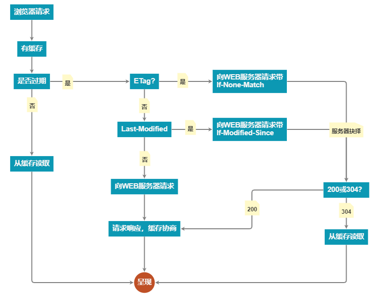

# 缓存机制：强缓存、协商缓存      
## 1、概述    
通过网络获取内容既速度缓慢又开销巨大。较大的响应需要在客户端与服务器之间进行多次往返通信，这会延迟浏览器获得和处理内容的时间，还会增加访问者的流量费用。因此，缓存并重复利用之前获取的资源的能力成为性能优化的一个关键方面。好在每个浏览器都自带了 HTTP 缓存实现功能。只需要确保每个服务器响应都提供正确的 HTTP 标头指令，以指示浏览器何时可以缓存响应以及可以缓存多久。   
### 1.1 浏览器缓存过程
#### 在浏览器第一次发起请求时，本地无缓存，向web服务器发送请求，服务器起端响应请求，浏览器端缓存。过程如下：    

    
>在第一次请求时，服务器会将页面最后修改时间通过Last-Modified标识由服务器发送给客户端，客户端记录修改时间；服务器还会生成一个Etag，并发送给客户端。   

#### 浏览器后续再次进行请求时：    

   

## 2、缓存位置    

### 2.1 memory cache   

memory cache是内存中的缓存，几乎所有的网络请求资源都会被浏览器自动加入到memory cache中，但是也正因为数量很大但是浏览器占用的内存不能无限扩大这两个因素，所以memory cache只能是个短期存储，常规情况下，浏览器的TAB关闭后该次浏览的memory cache便失效，而在极端情况下（一个页面的缓存就占用了超级多的内存），那可能在TAB没关闭前，排在前面的memory cache就失效了。总结一下，memory cache具有快速读取和时效性两个特点。快速读取是因为缓存的文件是存入内存当中的，时效性是因为进程关闭，该进程的内存就会清空。     

### 2.2 disk cache    

disk cache是硬盘上的缓存，所以disk cache是持久缓存，disk cache会严格按照HTTP头信息中的各类字段来判定哪些资源可以缓存，哪些资源不可以缓存；哪些资源是仍然可用的，哪些资源是过时需要重新请求的。当命中缓存之后，浏览器会从硬盘中读取资源，虽然比起从内存中读取慢了一些，但比起网络请求还是快了不少的。绝大部分的缓存都来自 disk cache。    

### 2.3 缓存获取优先级（由上到下寻找，找到即返回；找不到则继续）

>* memory cache    
>* disk cache     
>* HTTP请求     

## 3、缓存策略     

### 3.1 强缓存（强制缓存）     
强制缓存就是向浏览器缓存查找该请求结果，并根据该结果的缓存规则来决定是否使用该缓存结果的过程。可以造成强制缓存的字段是 Cache-control 和 Expires。     

#### 3.1.1 Expires     
这是 HTTP 1.0 的字段，表示缓存到期时间，是一个绝对的时间 (当前时间+缓存时间)，如：    

>Expires: Thu, 10 Nov 2017 08:45:11 GMT    

在响应消息头中，设置这个字段之后，就可以告诉浏览器，在未过期之前不需要再次请求。    

到了HTTP/1.1，Expire已经被Cache-Control替代，原因在于Expires控制缓存的原理是使用客户端的时间与服务端返回的时间做对比，那么如果客户端与服务端的时间因为某些原因（例如时区不同；客户端和服务端有一方的时间不准确）发生误差，那么强制缓存则会直接失效，这样的话强制缓存的存在则毫无意义。       

#### 3.1.2 Cache-control    

Cache-control字段表示资源的最大有效时间，在该时间内，客户端不需要向服务器发送请求。      

**Cache-control常用指令**     
>* no-store：直接禁止浏览器以及所有中间缓存存储任何版本的返回响应，例如，包含个人隐私数据或银行业务数据的响应。每次用户请求该资产时，都会向服务器发送请求，并下载完整的响应。          
>* no-cache：必须先与服务器确认返回的响应是否发生了变化，然后才能使用该响应来满足后续对同一网址的请求。因此，如果存在合适的验证令牌 (ETag)，no-cache 会发起往返通信来验证缓存的响应，但如果资源未发生变化，则可避免下载。     
>* public：可以被所有用户缓存（多用户共享），包括终端和CDN等中间代理服务器，即使它有关联的 HTTP 身份验证，甚至响应状态代码通常无法缓存，也可以缓存响应。大多数情况下，“public”不是必需的，因为明确的缓存信息（例如“max-age”）已表示响应是可以缓存的。    
>* private：只能被终端浏览器缓存（而且是私有缓存），不允许中继缓存服务器进行缓存。    
>* max-age：指令指定从请求的时间开始，允许获取的响应被重用的最长时间（单位：秒）。   

这些指令是可以混合使用的。    
**Expires和Cache-control是可以同时定义的，但是Cache-control的优先级高于Expires**     

### 3.2 对比缓存（协商缓存）     

当强制缓存失效(超过规定时间)时，就需要使用对比缓存，由服务器决定缓存内容是否失效。     

流程上说，浏览器先请求缓存数据库，返回一个缓存标识。之后浏览器拿这个标识和服务器通讯。如果缓存未失效，则返回 HTTP 状态码 304 表示继续使用，于是客户端继续使用缓存；如果失效，则返回新的数据和缓存规则，浏览器响应数据后，再把规则写入到缓存数据库。    

对比缓存在请求数上和没有缓存是一致的，但如果是 304 的话，返回的仅仅是一个状态码而已，并没有实际的文件内容，因此 在响应体体积上的节省是它的优化点。它的优化覆盖了文章开头提到过的请求数据的三个步骤中的最后一个：“响应”。通过减少响应体体积，来缩短网络传输时间。所以和强制缓存相比提升幅度较小，但总比没有缓存好。     

对比缓存是可以和强制缓存一起使用的，作为在强制缓存失效后的一种后备方案。实际项目中他们也的确经常一同出现。     

***对比缓存有 2 组字段***

#### 3.2.1 Last-Modified & If-Modified-Since    
1. 服务器通过 Last-Modified 字段告知客户端，资源最后一次被修改的时间，例如:    
      >Last-Modified: Mon, 10 Nov 2018 09:10:11 GMT       
2. 浏览器将这个值和内容一起记录在缓存数据库中。
3. 下一次请求相同资源时时，浏览器从自己的缓存中找出“不确定是否过期的”缓存。因此在请求头中将上次的 Last-Modified 的值写入到请求头的 If-Modified-Since 字段
4. 服务器会将 If-Modified-Since 的值与 Last-Modified 字段进行对比。如果相等，则表示未修改，响应 304；反之，则表示修改了，响应 200 状态码，并返回数据。       

但是他还是有一定缺陷的：    

>* 如果资源更新的速度是秒以下单位，那么该缓存是不能被使用的，因为它的时间单位最低是秒。     
>* 如果文件是通过服务器动态生成的，那么该方法的更新时间永远是生成的时间，尽管文件可能没有变化，所以起不到缓存的作用。      

#### 3.2.2 Etag & If-None-Match       
为了解决上述问题，出现了一组新的字段 Etag 和 If-None-Match

Etag 存储的是文件的特殊标识(一般都是 hash 生成的)，服务器存储着文件的 Etag 字段。之后的流程和 Last-Modified 一致，只是 Last-Modified 字段和它所表示的更新时间改变成了。    
Etag 字段和它所表示的文件 hash，把 If-Modified-Since 变成了 If-None-Match。服务器同样进行比较，命中返回 304, 不命中返回新资源和 200。
      
**Etag 的优先级高于 Last-Modified**

