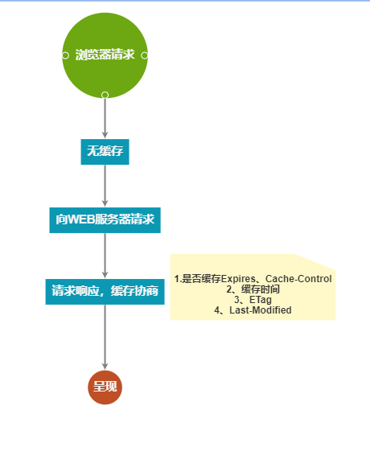

# 缓存机制：强缓存、协商缓存      
## 1、概述    
通过网络获取内容既速度缓慢又开销巨大。较大的响应需要在客户端与服务器之间进行多次往返通信，这会延迟浏览器获得和处理内容的时间，还会增加访问者的流量费用。因此，缓存并重复利用之前获取的资源的能力成为性能优化的一个关键方面。好在每个浏览器都自带了 HTTP 缓存实现功能。只需要确保每个服务器响应都提供正确的 HTTP 标头指令，以指示浏览器何时可以缓存响应以及可以缓存多久。   
### 1.1 浏览器缓存过程
#### 在浏览器第一次发起请求时，本地无缓存，向web服务器发送请求，服务器起端响应请求，浏览器端缓存。过程如下：    

    
>在第一次请求时，服务器会将页面最后修改时间通过Last-Modified标识由服务器发送给客户端，客户端记录修改时间；服务器还会生成一个Etag，并发送给客户端。   

#### 浏览器后续再次进行请求时：    

### 1.1 通过 ETag 验证缓存的响应
>* 服务器使用 ETag HTTP 标头传递验证令牌。    
>* 验证令牌可实现高效的资源更新检查：资源未发生变化时不会传送任何数据。      
 
假定在首次获取资源 120 秒后，浏览器又对该资源发起了新的请求。首先，浏览器会检查本地缓存并找到之前的响应。遗憾的是，该响应现已过期，浏览器无法使用。此时，浏览器可以直接发出新的请求并获取新的完整响应。不过，这样做效率较低，因为如果资源未发生变化，那么下载与缓存中已有的完全相同的信息就毫无道理可言！

这正是验证令牌（在 ETag 标头中指定）旨在解决的问题。服务器生成并返回的随机令牌通常是文件内容的哈希值或某个其他指纹。客户端不需要了解指纹是如何生成的，只需在下一次请求时将其发送至服务器。如果指纹仍然相同，则表示资源未发生变化，您就可以跳过下载。     
### 1.2 Cache-Control    
>* 每个资源都可通过 Cache-Control HTTP 标头定义其缓存策略    
>* Cache-Control 指令控制谁在什么条件下可以缓存响应以及可以缓存多久。     

**Cache-Control 标头是在 HTTP/1.1 规范中定义的，取代了之前用来定义响应缓存策略的标头（例如 Expires）。所有现代浏览器都支持 Cache-Control，因此，使用它就够了。**       
>* no-store：直接禁止浏览器以及所有中间缓存存储任何版本的返回响应，例如，包含个人隐私数据或银行业务数据的响应。每次用户请求该资产时，都会向服务器发送请求，并下载完整的响应。          
>* no-cache：必须先与服务器确认返回的响应是否发生了变化，然后才能使用该响应来满足后续对同一网址的请求。因此，如果存在合适的验证令牌 (ETag)，no-cache 会发起往返通信来验证缓存的响应，但如果资源未发生变化，则可避免下载。     
>* public：可以被所有用户缓存（多用户共享），包括终端和CDN等中间代理服务器，即使它有关联的 HTTP 身份验证，甚至响应状态代码通常无法缓存，也可以缓存响应。大多数情况下，“public”不是必需的，因为明确的缓存信息（例如“max-age”）已表示响应是可以缓存的。    
>* private：只能被终端浏览器缓存（而且是私有缓存），不允许中继缓存服务器进行缓存。    
>* max-age：指令指定从请求的时间开始，允许获取的响应被重用的最长时间（单位：秒）。    
